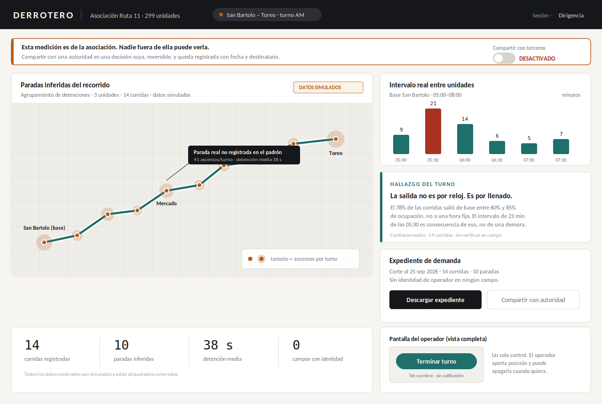
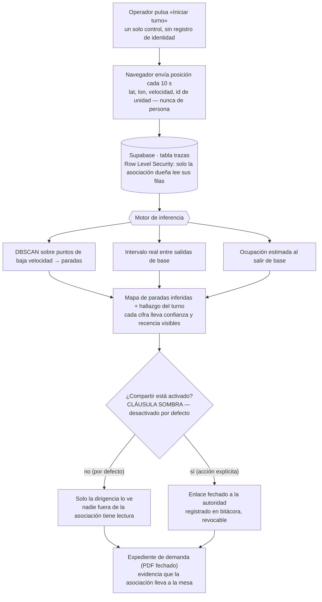
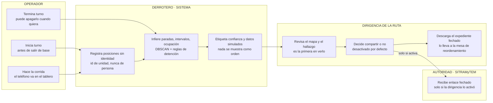

# PACKET — Week 7 · Business Bending
## DERROTERO — a route-side evidence instrument

**Author:** Fátima · **Team 2** · **Brain Bending role:** USER
**Blueprint declaration:** builds the route-side evidence instrument for the concessionaire / route association navigating the Naucalpan restructure. Honors **Condition 2** (shadow clause) most directly.
**Vacuum attacked:** the colectivo layer.

---

## 1. The problem, in my words

The state measured the routes and kept the result.

SITRAMyTEM commissioned demand studies on 52 concessioned routes in Naucalpan — how many users each route moves, what supply exists, what residents need — with fieldwork run 10 November to 31 December 2025. Those studies feed the decision about which routes survive and which become feeders to Mexicable Line 3. As of 30 June 2026, when operators blockaded the vehicle entrances at Metro Cuatro Caminos for more than seven hours demanding to know what happens to their routes, the results had not been made public. A representative of Ruta 11 (299 units) said the project began without considering companies that have run the service for over 40 years.

So the operators are being decided about, from a measurement they cannot see and did not help produce. They are not hiding from legibility — they shut down a Metro station asking to be counted.

**The vacuum is not missing data. It is one-shot measurement owned by the decider, with the measured party excluded from the output.** Mapatón was the same pattern with no consequences attached; CDMX's static GTFS has sat frozen since 30 March 2022 for the same reason. This one decides who survives.

Derrotero gives the measured party its own measurement, first.

---

## 2. The exact user

**Primary — the *dirigente* of a Naucalpan route association.** The person who will sit across a table from SITRAMyTEM and be told what their route becomes. Archetype: Rosa Isela Trinidad González of Transporte de la Tolva Ruta 11 — on the record in a national newspaper, 299 units, 40+ years of service, excluded from the study. She has an urgent, dated, self-interested reason to want evidence right now, and she has no instrument to produce it.

**Secondary — the operator (driver).** His phone is the sensor. He is never named, scored, ranked or penalized by the system. He gets one control.

**Why not the passenger.** Josefina (43, cleaning staff, three-leg 90-minute commute from San Bartolo, 70 pesos a day) is who the vacuum costs — she pays it in unpaid buffer time, leaving at 5:15 for a 7:00 shift. But she cannot buy, and a passenger-facing arrival app dies on cold start at 5:15, when the only phones moving on that route are the driver's and perhaps three passengers'. She is the beneficiary, not the customer. The route she rides is the route being restructured.

---

## 3. Success definition

> **Before the module closes:** a route association can run a shift with simulated vehicles, see its own inferred stops and real headways on a map, and export a dated ridership dossier that nobody outside the association can see until they explicitly turn on sharing.

Concretely, all of the following are true at the live URL:

1. A driver view starts and ends a shift with one control and no identity field.
2. Positions accumulate into a trace tied to a unit, never to a person.
3. The system infers stop locations from low-speed clusters and computes real headways between departures.
4. The dirigente sees a map of inferred stops sized by boardings, plus at least one stated finding with a visible confidence label.
5. Sharing is **off by default**; turning it on is an explicit, reversible, logged action.
6. A dated PDF dossier downloads.
7. All displayed data is labeled as simulated, on screen.

---

## 4. Mockup

Generated screen: the dirigente's main view. Note three deliberate choices — (a) the shadow clause is the first thing on the page and is a working control, not a policy note; (b) the simulated-data label is on the map panel itself, not in a footnote; (c) the operator's entire screen is one button, shown inset, so the asymmetry between who is measured and who holds the measurement is visible in the interface.

---

## 5. The flow

### 5.1 Flowchart — how the feature works

### 5.2 Swimlane — who does what

The authority is the only lane that cannot initiate anything. It receives, and only if the dirigencia decides.

---

## 6. Benchmark line

> **The best existing solution on Earth for this is** Driver's Seat Cooperative (US, 2020–2023), a driver-owned data cooperative whose app collected drivers' own trip data, returned it to them as earnings insight, and sold the aggregate to city and state governments for planning — the measured party owning the measurement.
>
> **Mine differs / localizes by** inverting the buyer and adding a clock: the customer is not a government purchasing mobility insight but the measured concessionaire itself, buying evidence of its own ridership because a restructure decision with a date attached will otherwise be made without it.

Why that difference matters: Driver's Seat closed as a business in 2023 and moved its app to Princeton's Workers' Algorithm Observatory, surviving as a research tool. The mechanism worked; the business model did not, because it depended on governments choosing to buy planning data. Mexican municipalities rarely do. The Naucalpan restructure creates a buyer that Driver's Seat never had — one with urgency, a budget, and something concrete to lose.

Secondary benchmarks considered: **Digital Matatus** (Nairobi, 2014 — open GTFS for informal routes; the method already crossed via Codeando México's Hub, what didn't cross is maintenance) and **Transport for London** (real-time data obligation written into the operating contract; Edomex has no equivalent GPS mandate, and the restructure is the moment new contracts get written).

---

## 7. The long view — three years

If the slice works, the association stops arguing from memory and starts arguing from its own record — and the same record that defends the route becomes the thing that improves it, because headways and boardings are finally visible to the people who actually control them. At three years, enough shifts are logged that what happens between routes, hours and passengers is written down rather than remembered: which run fills, which stretch collapses, where a unit is wasted, which transfer is worth a schedule. The passenger benefit arrives through the operator rather than around him — Josefina gets a combi she can count on because the association can finally see why it isn't one.

**Load-bearing walls this implies:** ownership stays with the association as the system scales (never a platform that accumulates routes as its own asset); no identity fields, ever, so no future product can be built on driver surveillance; and any aggregate sold onward is opt-in per association, never exclusive to whoever is deciding their fate.

---

## 8. Scope cut — what I am NOT building

| Not building | Why |
|---|---|
| A passenger-facing app of any kind | Forbidden Zone; and it dies on cold start at 5:15, her actual hour |
| Real-time arrival prediction | Departure is load-triggered, not clock-triggered — there is no schedule to predict against |
| Driver identity, login, profiles, scoring, ranking | Condition 3; and no identity field can leak if it does not exist |
| Any automated penalty, alert-to-supervisor, or dismissal function | Condition 3 |
| Payments, fare collection, concession paperwork | Out of slice |
| Native mobile app | Browser Geolocation is enough; an install step kills driver adoption |
| Real personal data of any real person | Security Floor item 5 — all data invented and labeled |
| A claim that this improves safety or saves money | Condition 6 — no pilot, no claim |

---

## 9. Architecture + stack

| Layer | Choice | Why this one | Cost |
|---|---|---|---|
| Frontend | Next.js (App Router), deployed on **Vercel** | required deploy target; free tier; env vars for secrets | $0 |
| Auth | **Supabase Auth**, Sign in with Google | Security Floor #2 — the dossier is association data behind a door | $0 |
| Database | **Supabase Postgres** — `associations`, `units`, `shifts`, `pings`, `inferred_stops`, `share_grants` | one relational store, free tier | $0 |
| Access control | **Row Level Security** on every table: rows readable only where `association_id` matches the caller's claim | Security Floor #3 **and** Condition 2 — the shadow clause enforced in the database, not just the UI | — |
| Map + geodata | **MapLibre GL JS** + OpenStreetMap-based free tiles; route and stops as GeoJSON layers | no credit card required, unlike Google Maps | $0 |
| **ML** | **DBSCAN** clustering over low-speed pings → inferred stop locations; headway estimation and occupancy-at-departure inference, run in a Next.js API route | Dragon Stack: ML. Explainable, not decorative — the model's job is to turn raw pings into the two numbers the dirigente argues with | $0 |
| **Phone telemetry** | Browser **Geolocation API** (`watchPosition`) on the operator's phone, batched every 10 s | Dragon Stack: third element. No install, no app store | $0 |
| Simulated data | Seeded generator: 3 units × 14 runs along the San Bartolo–Toreo corridor, with load-triggered departures | labeled on screen per Security Floor #5 | — |
| Dossier | Client-side PDF generation, dated, with confidence labels carried through | the object the association takes to the table | $0 |
| Input validation | Length and type checks on every form field before it reaches the database | Security Floor #4 | — |
| Secrets | Vercel environment variables only; nothing in the repo | Security Floor #1 | — |

**Dragon Stack floor met:** geodata/maps + ML + phone telemetry.

---

## 10. Test plan

### 10.1 Mechanical pass

| # | Check | Pass condition |
|---|---|---|
| 1 | Driver starts and ends a shift | Shift row created and closed; no identity field written anywhere |
| 2 | Position capture | Pings accumulate with `unit_id`; denying location permission degrades gracefully with a readable message |
| 3 | Stop inference | DBSCAN returns ≥ 8 stops on the seeded corridor; obvious noise points excluded |
| 4 | Headway computation | Headways match the seeded generator within tolerance |
| 5 | **RLS** | A second association's account, signed in, sees **zero** rows of the first association's data — tested by actually logging in as both |
| 6 | Shadow clause default | A fresh association loads with sharing **off**; no share link resolves |
| 7 | Sharing is explicit and reversible | Turning it on creates a dated, logged grant; turning it off invalidates the link immediately |
| 8 | Dossier | PDF downloads, is dated, contains confidence labels, and contains no identity field |
| 9 | Labeling | "DATOS SIMULADOS" visible on the map panel on every load |
| 10 | Validation | Over-length and wrong-type input is rejected before reaching the database |

At least one real bug found, fixed, and redeployed — documented in `DECISIONS.md`.

### 10.2 Persona pass (Layer 1)

Synthetic user, built from the User research:

> **"You are Rosa, 58. You are the representative of a route association with 299 units in Naucalpan; your family has run this route for over forty years. You use WhatsApp constantly and a computer rarely. You read carefully but slowly, and you do not trust software that looks like it came from the government — you have seen data used against operators before. You will not type personal information into a screen you do not understand. If something confuses you, you do not ask; you close it and call someone instead."**

She will be walked screen by screen through: opening the dashboard → understanding what the map is showing → understanding who can see it → exporting the dossier. Every hesitation logged in `PERSONA_fatima.pdf`; the worst confusion fixed before the deadline.

**What I expect her to get stuck on, and will be watching for:** whether "DESACTIVADO" reads as *broken* rather than as *protected*, and whether "paradas inferidas" means anything to someone who has known those stops for forty years.

---

## Blueprint conditions — where each one lives in the build

| Condition | Where it is enforced |
|---|---|
| 1 · No driver made financially worse off by being measured | No scoring, no ranking, no supervisor-facing view of any individual operator exists in the schema |
| **2 · SHADOW CLAUSE — measured party owns and receives the measurement first; no exclusive-use contract with whoever decides its fate** | **RLS policies scoped to `association_id`; sharing off by default; grants are dated, logged, revocable, and non-exclusive by construction** |
| 3 · No automated penalty, deduction, scoring or dismissal | No such function exists; the dossier reports the route, not the person |
| 4 · Uncertain intelligence never shown as a command; source, recency, confidence visible; driver keeps authority | Every inferred figure carries a confidence label and a run count on screen; the driver's view issues no instructions at all |
| 5 · Enforcement attaches to the concession entity, prospectively, only where a real mandate exists | Out of slice by design — nothing in this build is sold to an enforcement buyer |
| 6 · No claim of proven safety or cost improvement without sourced pilot evidence | No such claim appears in the UI, the dossier, or the demo video |
